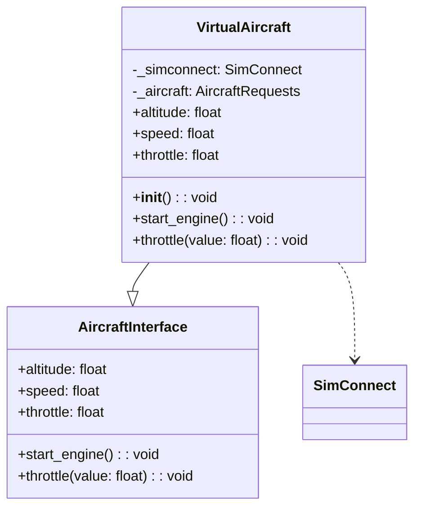

```mermaid
classDiagram
    class AircraftInterface {
        +altitude: float
        +speed: float
        +start_engine(): void
        +throttle: float
        +throttle(value: float): void
    }

    class VirtualAircraft {
        -_simconnect: SimConnect
        -_aircraft: AircraftRequests
        +__init__(): void
        +altitude: float
        +speed: float
        +start_engine(): void
        +throttle: float
        +throttle(value: float): void
    }

    VirtualAircraft --|> AircraftInterface

    VirtualAircraft ..> SimConnect
```
