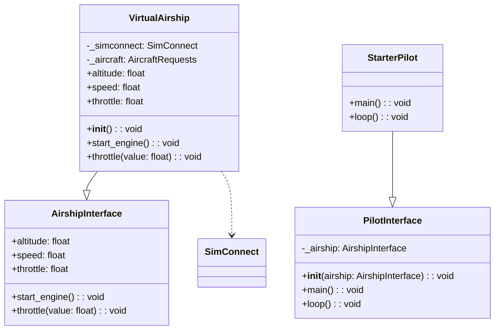

```mermaid
classDiagram
    class AirshipInterface {
        +altitude: float
        +speed: float
        +start_engine(): void
        +throttle: float
        +throttle(value: float): void
    }

    class VirtualAirship {
        -_simconnect: SimConnect
        -_aircraft: AircraftRequests
        +__init__(): void
        +altitude: float
        +speed: float
        +start_engine(): void
        +throttle: float
        +throttle(value: float): void
    }

    class PilotInterface {
        -_airship: AirshipInterface
        +__init__(airship: AirshipInterface): void
        +main(): void
        +loop(): void
    }

    class StarterPilot {
        +main(): void
        +loop(): void
    }

    StarterPilot --|> PilotInterface
    VirtualAirship --|> AirshipInterface

    VirtualAirship ..> SimConnect
```
