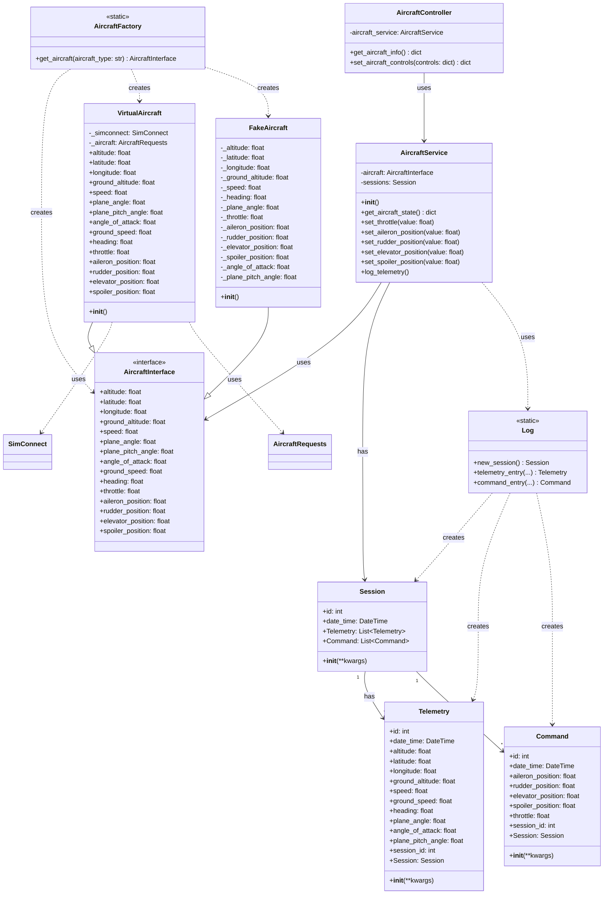

```mermaid
classDiagram
    %% Aircraft Models
    class AircraftInterface {
        <<interface>>
        +altitude: float
        +latitude: float
        +longitude: float
        +ground_altitude: float
        +speed: float
        +plane_angle: float
        +plane_pitch_angle: float
        +angle_of_attack: float
        +ground_speed: float
        +heading: float
        +throttle: float
        +aileron_position: float
        +rudder_position: float
        +elevator_position: float
        +spoiler_position: float
    }

    class VirtualAircraft {
        -_simconnect: SimConnect
        -_aircraft: AircraftRequests
        +__init__()
        +altitude: float
        +latitude: float
        +longitude: float
        +ground_altitude: float
        +speed: float
        +plane_angle: float
        +plane_pitch_angle: float
        +angle_of_attack: float
        +ground_speed: float
        +heading: float
        +throttle: float
        +aileron_position: float
        +rudder_position: float
        +elevator_position: float
        +spoiler_position: float
    }

    class FakeAircraft {
        -_altitude: float
        -_latitude: float
        -_longitude: float
        -_ground_altitude: float
        -_speed: float
        -_heading: float
        -_plane_angle: float
        -_throttle: float
        -_aileron_position: float
        -_rudder_position: float
        -_elevator_position: float
        -_spoiler_position: float
        -_angle_of_attack: float
        -_plane_pitch_angle: float
        +__init__()
    }

    %% Factory
    class AircraftFactory {
        <<static>>
        +get_aircraft(aircraft_type: str) AircraftInterface
    }

    %% Service Layer
    class AircraftService {
        -aircraft: AircraftInterface
        -sessions: Session
        +__init__()
        +get_aircraft_state() dict
        +set_throttle(value: float)
        +set_aileron_position(value: float)
        +set_rudder_position(value: float)
        +set_elevator_position(value: float)
        +set_spoiler_position(value: float)
        +log_telemetry()
    }

    %% Controller
    class AircraftController {
        -aircraft_service: AircraftService
        +get_aircraft_info() dict
        +set_aircraft_controls(controls: dict) dict
    }

    %% Database Models
    class Session {
        +id: int
        +date_time: DateTime
        +Telemetry: List~Telemetry~
        +Command: List~Command~
        +__init__(**kwargs)
    }

    class Telemetry {
        +id: int
        +date_time: DateTime
        +altitude: float
        +latitude: float
        +longitude: float
        +ground_altitude: float
        +speed: float
        +ground_speed: float
        +heading: float
        +plane_angle: float
        +angle_of_attack: float
        +plane_pitch_angle: float
        +session_id: int
        +Session: Session
        +__init__(**kwargs)
    }

    class Command {
        +id: int
        +date_time: DateTime
        +aileron_position: float
        +rudder_position: float
        +elevator_position: float
        +spoiler_position: float
        +throttle: float
        +session_id: int
        +Session: Session
        +__init__(**kwargs)
    }

    %% Logging Utility
    class Log {
        <<static>>
        +new_session() Session
        +telemetry_entry(...) Telemetry
        +command_entry(...) Command
    }

    %% Relationships
    VirtualAircraft --|> AircraftInterface
    FakeAircraft --|> AircraftInterface
    
    AircraftFactory ..> AircraftInterface : creates
    AircraftFactory ..> VirtualAircraft : creates
    AircraftFactory ..> FakeAircraft : creates
    
    AircraftService --> AircraftInterface : uses
    AircraftService --> Session : has
    AircraftService ..> Log : uses
    
    AircraftController --> AircraftService : uses
    
    Session "1" --> "*" Telemetry : has
    Session "1" --> "*" Command : has
    
    Log ..> Session : creates
    Log ..> Telemetry : creates
    Log ..> Command : creates
    
    VirtualAircraft ..> SimConnect : uses
    VirtualAircraft ..> AircraftRequests : uses
```
